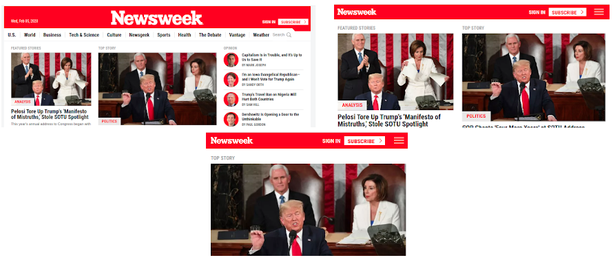

# USING BOOTSTRAP

> In this project, we got the chance to build a responsive website. We’ll be cloning [News Week](http://www.newsweek.com/), a news-focused page which uses media queries to gracefully degrade their site as the window size is reduced.

## Built With

- HTML5/CSS3
- Bootstrap
- Visual Studio Code
- The Stickler Linter
- Nu HTML Validator
- W3C CSS Validator
- Beautify

## Live Demo

[Live Demo Link](https://rawcdn.githack.com/Dandush03/Using-Bootstrap/093e82fb4e501ca794e2436e802c3f624424f1bd/index.html)

## Getting Started

**The webpage is only a clone. None of the elements in it really work. It is only to showcase our HTML, CSS and Bootstrap coding abilities.**

## Authors

**Danie Laloush**
- Github: [@Dandush03](https://github.com/Dandush03)
- Twitter: [@d_laloush](https://twitter.com/d_laloush)
- Linkedin: [Daniel Laloush](https://www.linkedin.com/in/daniel-laloush-0a7331a9) check what I'm talking about!

## 🤝 Contributing

Contributions, issues and feature requests are welcome!

Feel free to check the [issues page](./issues/).

## Show your support

Give a ⭐️ if you like this project!

## Acknowledgments

- Hat tip to anyone whose code was used
- Thanks to Microverse!
- Thanks to News Week for letting us clone it's homepage!

## 📝 License

This project is [MIT](lic.url) licensed.
